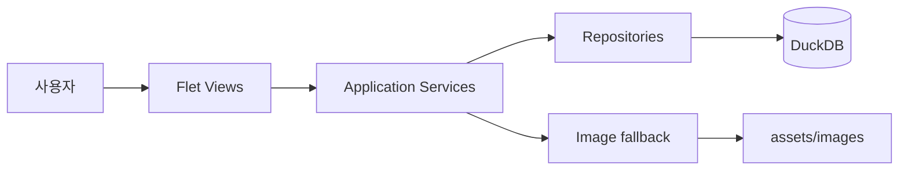

# 전체 시스템 구성

```mermaid
flowchart LR
    U["사용자"] --> V["Flet Views"]
    V --> S["Application Services"]
    S --> R["Repositories"]
    R --> D[("DuckDB")]
    S --> I["Image fallback"]
    I --> A["assets/images"]
```

View는 SQL을 실행하지 않는다. Service는 입력 검증과 주문 트랜잭션 규칙을 담당하고, Repository만 DuckDB에 접근한다.
